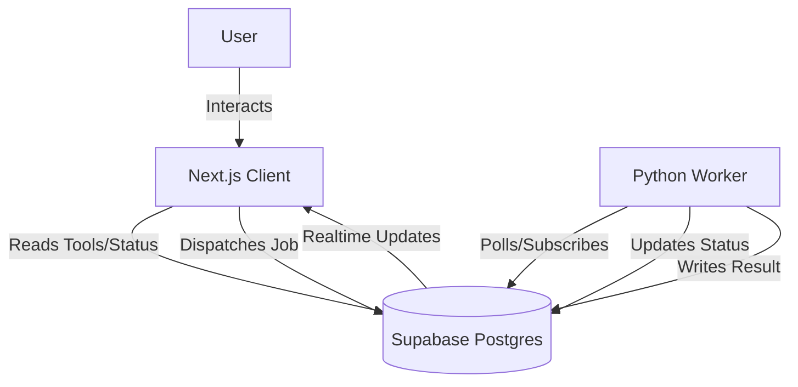

# Design: Toolbox Architecture

## Overview

The Toolbox operates on an asynchronous "Dispatch" model. The frontend acts as a command center, queuing jobs into a central database. A background worker (or fleet of workers) picks up these jobs, executes them (often long-running tasks like scraping or AI generation), and reports the results back.

## Architecture

## Data Models

### Tools (`tools`)
The core catalog of capabilities.
- **Static Metadata**: Name, description, icon.
- **State**: Current status (e.g., 'building', 'live').

### Jobs (`jobs`)
The unit of work.
- **Queued**: Inserted by Client.
- **Running**: Locked by Worker.
- **Completed**: Updated by Worker with `result_payload`.

## Tech Stack Choices

- **Supabase**: Chosen for:
  - **Instant API**: No need to write a custom backend API server just for CRUD.
  - **Realtime**: Vital for the "Command Center" feel. The Status Board needs to update live without refreshing.
  - **Auth**: built-in RLS (Row Level Security) ensures only authorized users can dispatch expensive jobs.

- **Python Worker**:
  - Chosen because the heavy lifting (Scraping, AI) is best done in Python libraries (BeautifulSoup, Pandas, etc.).
  - Separated from the Next.js API routes to avoid Vercel timeouts on long operations.
